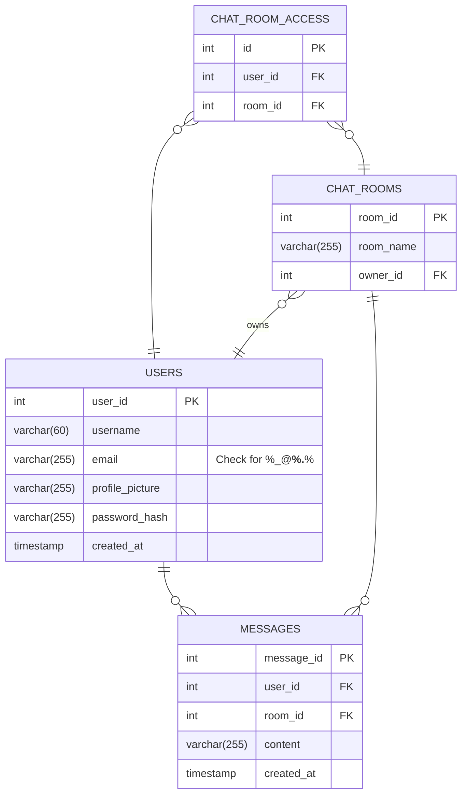

# Real time Chat App
This project is a Flask-based web application with SocketIO integration for real-time chat functionality. It includes user authentication, signup, login, and chat room creation features. The application connects to a MySQL database to store user information, messages, and chat rooms. Users can join existing chat rooms, create new ones, and send/receive messages in real-time. The server-side application is structured with routes for handling user interactions and utilizes SocketIO for handling real-time communication between clients. The project also includes API endpoints for retrieving messages, searching users, and other related functionalities.

# API Endpoints

## 1. Get Messages by Room

### Endpoint: `GET /api/messages/room`

### Description:
Retrieves messages for a specific chat room.

### Parameters:
- `q` (Query parameter): Room name for which messages are to be retrieved.

### Example: `GET /api/messages/room?q=example_room`

## 2. Get All Messages

### Endpoint:
`GET /api/messages`

### Description:
Retrieves all messages from all chat rooms.

### Example:
```bash
GET /api/messages
```

## 3. Search Messages

### Endpoint: `GET /api/messages/search`

### Description:
Searches messages based on a provided search term.

### Parameters:
- `q` (Query parameter): Search term.

### Example:
```bash
GET /api/messages/search?q=search_term
```

## 4. Get Messages by Username

### Endpoint: `GET /api/messages/username`

### Description:
Retrieves messages for a specific user.

### Parameters:
- `q` (Query parameter): Username for which messages are to be retrieved.

### Example:
```bash
GET /api/messages/username?q=example_user
```

## 5. Search Users

### Endpoint: `GET /api/users`

### Description:
Searches users based on a provided search term.

### Parameters:
- `q` (Query parameter): Search term.

### Example:
```bash
GET /api/users?q=search_term
```
---

## Database Schema 📚

